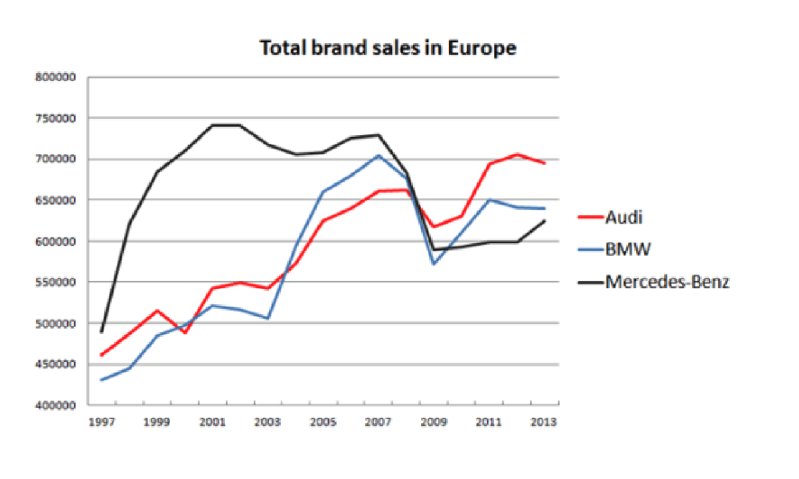
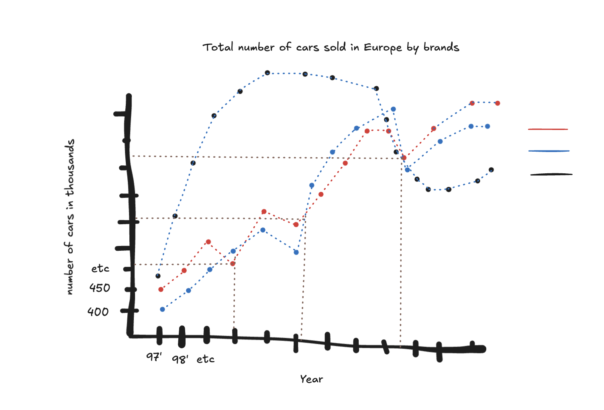
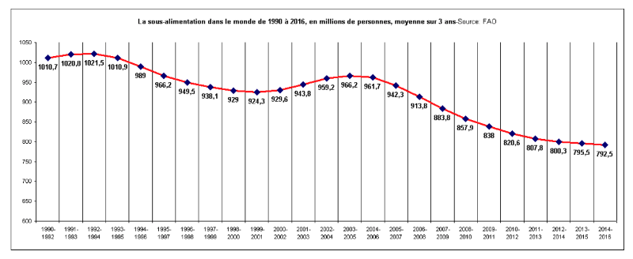
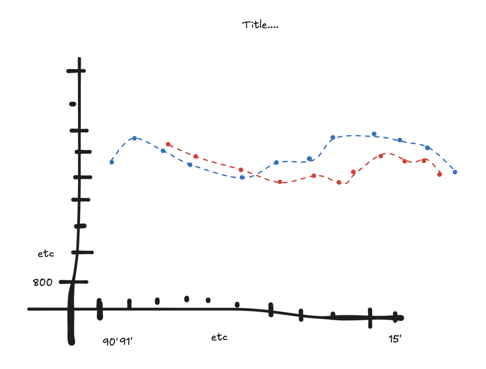
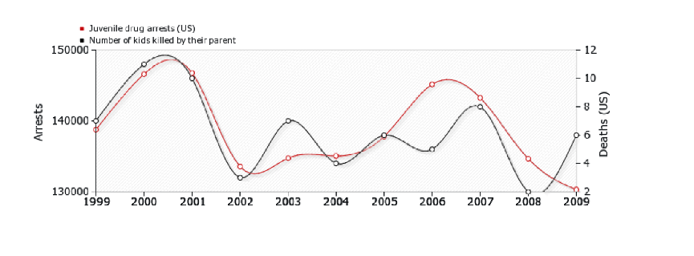
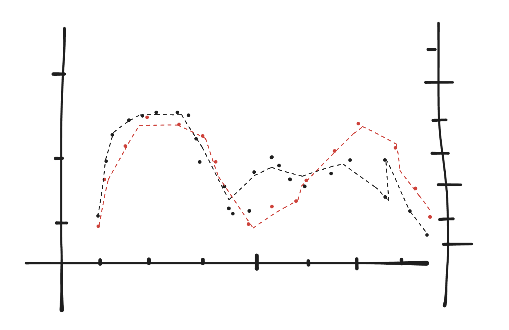

# SMPE-lab

## 2. 02/10/25 [ AL ] Clearly defining the experiment and having the right tools to analyze it

M2R-ParallelQuicksort repository for nots of the whole group, improved experiments and plots: https://github.com/viniciuslazzari/M2R-ParallelQuicksort

## 3. 09/10/25 [ JMV ] Visualization and Exploratory Data Analysis

Improvement of 3 plots from the presentation:

Original plot: 

- instead of just lines, this should be a scatterplot, points can be connected with lines but it should be clear that this is not continues data but something that was calculated once a year (at least it seems like it from the line shape) 
- we don't know what is the unit of y-axis
- x-axis tick labels are not properly located under the ticks, this is confusing
- both axis should be labeled 
- crossing of the curves should be marked with dotted line for example (around 2009)
- title is not informative enough, sales of what? cars, is it measured in currency? we don't know

Imporved plot:

-------

Original plot: 

- it would be better and more clearly to visualize the raw data, not just mean and then add a line that would mean moving average of last 3 years 
- the x-axis is really confiusing, the years are overlapping, we are be sure what the lines are actually separating, it should be tick per year 
- both axis are are not labeled properly
- labels under points of the lines could be removed I don't think any information is added here
- vertical line shows mean, it should show error bards

Improved plot: 

---

Original plot: 

- interpolation does not make any sense here, why the curves look like this? it misleads the reader of what was happening in between
- the building method of the curve is not clear, it should be just a scatter plot (possibly with connected dots) 

Improved: 

